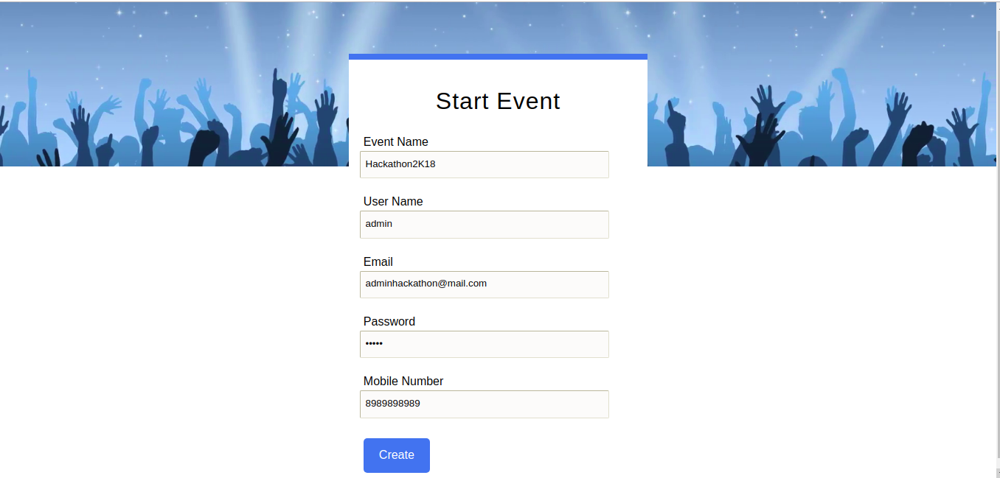
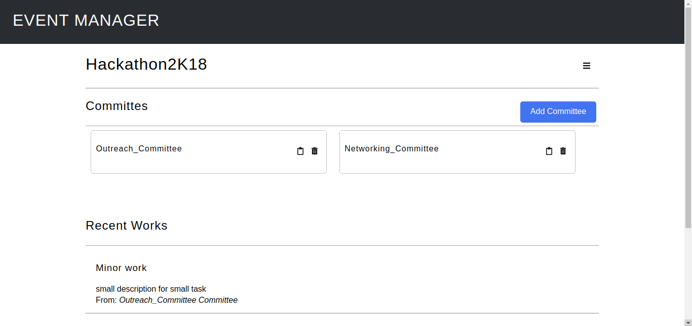
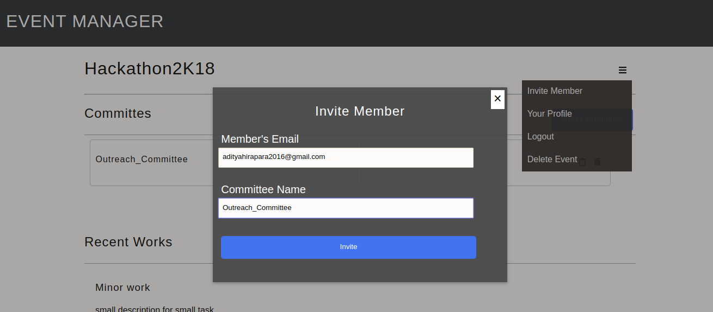
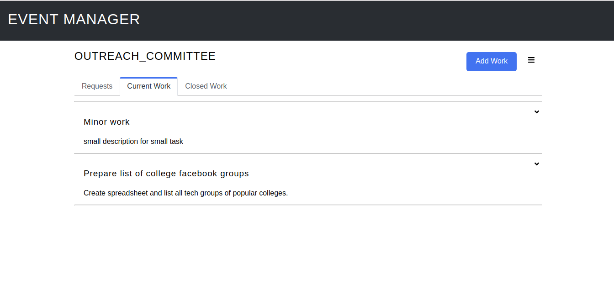
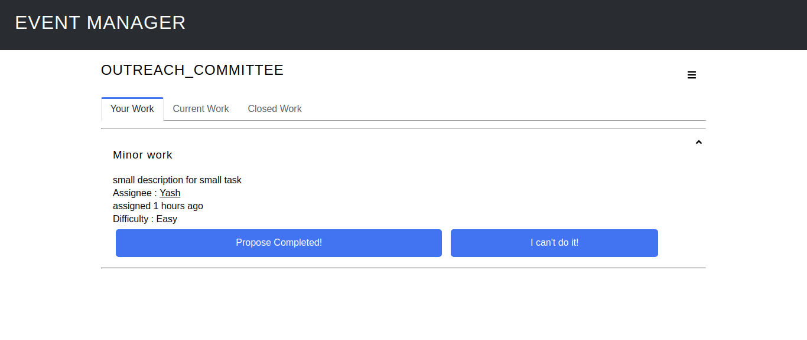
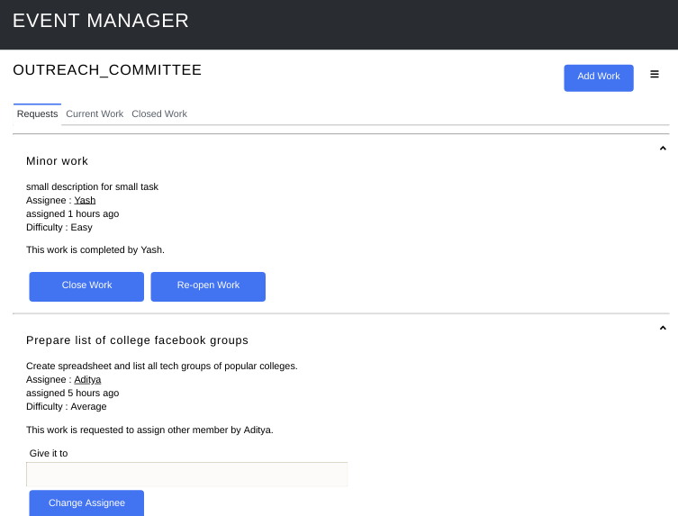
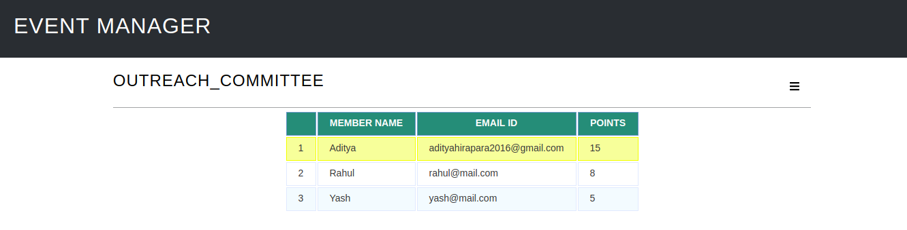

# Event-Manager
A web application, which helps event organisers to manage the event. Organisers can easily assign works to volunteers and can keep track of all works and volunteers. It also rates people according to their work.

## Functionality

1. Admin (Event Organisers) can create a new event and create committees from their dashboard.

2. Admin can invite other members (volunteers) to any committee. Invitation mail with a link as per selected committee will be sent to the member, who can sign up using that link.

3. Admin can add works to committees and assign it to any member. Work will be shown immediately to the respective member on their dashboard. 

4. Member can claim the completion when work gets completed or deny if he won't able to do! 

5. This requests will be shown to admin at **Requests** section of the respective committee. From where admin can close work if completed or reject the proposal and work will reassign to member. 
Also, admin can change assignee when one denies to do it (because of some reason :wink:).

6. Member will be rewarded with points for their works and get the rank on the leaderboard of respective committee.

7. Admin can track the entire event's work history at **Closed Work** section!

## Prerequisites

You will need the following things properly installed on your computer.

* **[Git](https://git-scm.com/)** - Git is a version control system which helps in tracking changes in files and also in coordinating with number of people on same project.
* **[Node.js](https://nodejs.org/)** *(node v9.2.1)* *(with NPM v5.5.1)* - Node.js is a JavaScript runtime which is built on the top of chrome's v8 JavaScript engine. You can install Node.js easily with [nvm](https://github.com/creationix/nvm).

## Installation

* `git clone <repository-url>` this repository
* `cd Event-Manager`
* `npm install` - This will install all the npm packages that are needed.

## Running / Development

* `node index`
* Visit your app at [http://localhost:3000](http://localhost:3000).

## Join the development:

##### Open issues and send PRs, feel free to contribute.
